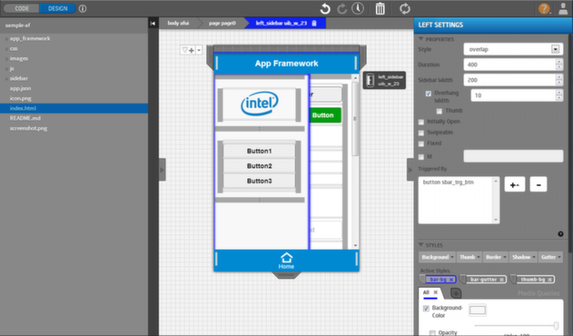
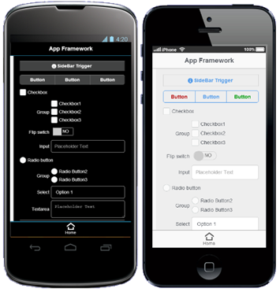

## Purpose

The purpose of the App Framework sample is to provide a basic starting point for HTML5 developers to get expose to the capabilities of the App Designer tool integrated into the [Intel® XDK](http://software.intel.com/en-us/html5/tools). The App Designer is a drag & drop UI tool that supports various JavaScript UI Frameworks for developing the responsive layout of HTML5 application. For more information on App Designer, visit the [App Designer Overview](https://software.intel.com/en-us/xdk/docs/app-designer-overview) page. This sample is built on the App Framework UI library. The App Framework UI Library is an open source HTML5 UI framework project that provides UI controls that adapts the native look and feel of the mobile platform that it is viewed. App Framework is fully documented on the [App Framework Guide](http://app-framework-software.intel.com/documentation.php) website.

The body of the application consists of a few UI elements such as buttons, checkboxes, flip switches, input fields, text areas, radio buttons, widgets and animated sidebars. The animated sidebars in the application is triggered by the “SideBar Trigger” button by being targeted through the App Designer’s Properties Panel for the Sidebar.

Since this sample was developed using the App Designer tool, you can upload the project to Intel XDK and continue modifying the layout immediately if you download it directly from github. Also the sample is accessible within the Intel XDK under the Projects > Start a New Project > Work with a Demo Panel.

## Testing

This sample has been tested on various iOS*, Windows Phone* and Android* devices.